# AMOEBANATOR APEX — 2060 MASTER BLUEPRINT

> **Classification:** Internal Research Blueprint  
> **Version:** 2.0 — Complete Implementation Specification  
> **Date:** 2026-02-01  
> **Target:** Nobel-worthy, hospital-ready, 2060-level autonomous biomedical AI  

---

# TABLE OF CONTENTS

1. [Executive Summary](#1-executive-summary)
2. [System Architecture](#2-system-architecture)
3. [Self-Learning RAG Engine](#3-self-learning-rag-engine)
4. [Database Architecture](#4-database-architecture)
5. [Cryptographic Security](#5-cryptographic-security)
6. [Multi-Modal AI Core](#6-multi-modal-ai-core)
7. [Training Pipeline](#7-training-pipeline)
8. [Uncertainty & Safety](#8-uncertainty--safety)
9. [Hospital Integration](#9-hospital-integration)
10. [Federated Learning](#10-federated-learning)
11. [Regulatory Compliance](#11-regulatory-compliance)
12. [Implementation Phases](#12-implementation-phases)
13. [API Specifications](#13-api-specifications)
14. [Research & Publication](#14-research--publication)

---

# 1. EXECUTIVE SUMMARY

## 1.1 The Problem We Solve

**Naegleria fowleri (PAM)** kills 97%+ of patients within 3–7 days because:
- Mimics bacterial meningitis → clinicians don't suspect it
- Gold standard (wet-mount + PCR) takes hours–days
- No automated, real-time, high-sensitivity detector exists
- Diagnosis often happens post-mortem

## 1.2 Our 2060 Solution

**AMOEBANATOR APEX** is the world's first:
- ✅ Self-learning multi-modal AI for ultra-early PAM detection
- ✅ Autonomous RAG system that evolves with medical literature
- ✅ Fully encrypted inference (PHI never decrypted)
- ✅ Hospital-ready with FHIR/HL7/DICOM integration
- ✅ Provably safe with formal coverage guarantees
- ✅ Federated across global sites without sharing patient data

## 1.3 Nobel-Worthy Innovations

| Innovation | Why It's Novel |
|---|---|
| Homomorphic RAG | First retrieval-augmented generation on encrypted medical data |
| Neuro-Symbolic Causal AI | Differentiable knowledge graphs + causal discovery for diagnosis |
| Self-Evolving Foundation Model | Continual meta-learning without catastrophic forgetting |
| Physics-Informed Microscopy AI | Zero-shot trophozoite detection via motion physics simulation |
| Provably Safe Abstention | Formal verification of coverage guarantees |

---

# 2. SYSTEM ARCHITECTURE

## 2.1 High-Level Architecture Diagram


## 2.2 Module Directory Structure

```
amoebanator_apex/
├── README.md
├── pyproject.toml
├── docker-compose.yml
├── .env.example
│
├── apex/
│   ├── __init__.py
│   ├── config.py                    # Central configuration
│   │
│   ├── crypto/                      # 🔐 Cryptographic Security
│   │   ├── __init__.py
│   │   ├── homomorphic.py           # CKKS/BFV for encrypted inference
│   │   ├── post_quantum.py          # Kyber-1024 + Dilithium
│   │   ├── zkp.py                   # Zero-knowledge proofs
│   │   ├── enclave.py               # SGX/TrustZone wrappers
│   │   ├── key_management.py        # HSM + MPC key ceremonies
│   │   └── did.py                   # Decentralized identity
│   │
│   ├── db/                          # 🗄️ Database Layer
│   │   ├── __init__.py
│   │   ├── postgres.py              # Encrypted relational (patients, cases)
│   │   ├── vector_db.py             # Qdrant/Milvus for embeddings
│   │   ├── graph_db.py              # Neo4j for ontology + causal DAG
│   │   ├── time_series.py           # TimescaleDB for vitals, labs
│   │   ├── blob_store.py            # S3-compatible for images/video
│   │   └── migrations/              # Alembic migrations
│   │
│   ├── rag/                         # 🧠 Self-Learning RAG Engine
│   │   ├── __init__.py
│   │   ├── retriever.py             # Encrypted neural retriever
│   │   ├── knowledge_base.py        # PubMed, guidelines, case reports
│   │   ├── indexer.py               # Continuous indexing pipeline
│   │   ├── generator.py             # Neuro-symbolic reasoning LLM
│   │   ├── self_learner.py          # Autonomous knowledge acquisition
│   │   ├── feedback_loop.py         # Clinician feedback integration
│   │   └── memory.py                # Long-term + working memory
│   │
│   ├── models/                      # 🤖 Multi-Modal AI Core
│   │   ├── __init__.py
│   │   ├── tabular/
│   │   │   ├── bayesian_mlp.py      # MC Dropout + Deep Ensemble
│   │   │   ├── evidential.py        # Dirichlet outputs
│   │   │   └── embedding.py         # Learned tabular embeddings
│   │   ├── vision/
│   │   │   ├── video_transformer.py # 4D spatio-temporal (TimeSformer++)
│   │   │   ├── microscopy.py        # Trophozoite motion detector
│   │   │   ├── imaging_3d.py        # MRI/CT 3D CNN + ViT
│   │   │   └── optical_flow.py      # Motion fingerprinting
│   │   ├── genomic/
│   │   │   ├── pcr_encoder.py       # Amplicon transformer
│   │   │   └── sequence_embed.py    # DNA/RNA embeddings
│   │   ├── fusion/
│   │   │   ├── cross_attention.py   # Multi-modal attention
│   │   │   ├── gated_fusion.py      # Modality gating
│   │   │   └── foundation.py        # Unified foundation model
│   │   └── neuro_symbolic/
│   │       ├── ontology.py          # SNOMED-CT, ICD-11, LOINC
│   │       ├── causal_dag.py        # Learned causal structure
│   │       ├── reasoning.py         # Differentiable logic
│   │       └── constraints.py       # Hard safety rules
│   │
│   ├── uncertainty/                 # 🛡️ Uncertainty & Safety
│   │   ├── __init__.py
│   │   ├── bayesian.py              # Ensemble + MC Dropout
│   │   ├── evidential.py            # Dirichlet uncertainty
│   │   ├── conformal.py             # Adaptive conformal prediction
│   │   ├── ood/
│   │   │   ├── flow.py              # Normalizing flow density
│   │   │   ├── energy.py            # Energy-based OOD
│   │   │   ├── mahalanobis.py       # Distance-based OOD
│   │   │   └── reconstruction.py    # Autoencoder OOD
│   │   ├── abstain.py               # Formally verified abstain logic
│   │   └── verification.py          # Formal safety proofs
│   │
│   ├── training/                    # 🏋️ Training Pipeline
│   │   ├── __init__.py
│   │   ├── self_supervised.py       # Contrastive + masked prediction
│   │   ├── meta_learning.py         # MAML++ / Hypernetworks
│   │   ├── continual.py             # EWC, PackNet, progressive
│   │   ├── curriculum.py            # Self-play adversarial
│   │   ├── synthetic/
│   │   │   ├── tabular_diffusion.py # Diffusion for patient profiles
│   │   │   ├── video_diffusion.py   # Conditional microscopy synthesis
│   │   │   └── causal_augment.py    # Interventional augmentation
│   │   ├── nas.py                   # Neural architecture search
│   │   └── distributed.py           # Multi-GPU/TPU training
│   │
│   ├── federated/                   # 🌐 Federated Learning
│   │   ├── __init__.py
│   │   ├── server.py                # Flower aggregation server
│   │   ├── client.py                # Hospital client
│   │   ├── secure_agg.py            # MPC secure aggregation
│   │   ├── differential_privacy.py  # DP-SGD
│   │   ├── byzantine.py             # Byzantine-resilient aggregation
│   │   └── personalization.py       # Per-site adaptation
│   │
│   ├── inference/                   # ⚡ Inference Engine
│   │   ├── __init__.py
│   │   ├── encrypted.py             # Homomorphic inference
│   │   ├── edge.py                  # ONNX/TensorRT for NPU
│   │   ├── batch.py                 # Batch inference
│   │   ├── streaming.py             # Real-time video inference
│   │   └── api.py                   # REST/gRPC endpoints
│   │
│   ├── integration/                 # 🏥 Hospital Integration
│   │   ├── __init__.py
│   │   ├── fhir.py                  # FHIR R5 client + server
│   │   ├── hl7.py                   # HL7 v2 adapter
│   │   ├── dicom.py                 # DICOM ingestion
│   │   ├── ehr_connectors/
│   │   │   ├── epic.py
│   │   │   ├── cerner.py
│   │   │   └── meditech.py
│   │   └── smart_microscope.py      # Microscope device integration
│   │
│   ├── compliance/                  # 📋 Regulatory Compliance
│   │   ├── __init__.py
│   │   ├── hipaa.py                 # HIPAA policy-as-code
│   │   ├── gdpr.py                  # GDPR compliance checks
│   │   ├── fda_samd.py              # SaMD documentation generator
│   │   ├── iso_13485.py             # QMS integration
│   │   ├── audit_log.py             # Blockchain-anchored audit
│   │   ├── risk_matrix.py           # ISO 14971 risk management
│   │   └── provenance.py            # Cryptographic artifact signing
│   │
│   ├── ui/                          # 💻 User Interface
│   │   ├── __init__.py
│   │   ├── dashboard/               # Streamlit/React dashboard
│   │   ├── ar_interface.py          # AR microscopy guidance
│   │   ├── voice.py                 # Voice commands
│   │   └── explainability.py        # Counterfactual UI
│   │
│   └── monitoring/                  # 📊 Monitoring & Observability
│       ├── __init__.py
│       ├── drift.py                 # Data + concept drift detection
│       ├── fairness.py              # Bias monitoring
│       ├── performance.py           # Latency, throughput
│       └── alerts.py                # Anomaly alerting
│
├── tests/                           # 🧪 Test Suite
│   ├── unit/
│   ├── integration/
│   ├── security/
│   └── regulatory/
│
├── scripts/                         # 🔧 Utility Scripts
│   ├── train.py
│   ├── evaluate.py
│   ├── deploy.py
│   └── federated_run.py
│
├── docs/                            # 📚 Documentation
│   ├── APEX_2060_MASTER_BLUEPRINT.md
│   ├── API.md
│   ├── DEPLOYMENT.md
│   └── REGULATORY.md
│
└── infrastructure/                  # ☁️ Infrastructure as Code
    ├── terraform/
    ├── kubernetes/
    └── docker/
```

---

## 3. SELF-LEARNING RAG ENGINE

### 3.1 Architecture Overview

The RAG engine is the **brain** of AMOEBANATOR APEX — it autonomously learns from medical literature, clinical guidelines, and case reports while operating on **encrypted data**.


### 3.2 Self-Learning Mechanisms

| Mechanism | Description | Implementation |
| --- | --- | --- |
| **Autonomous Crawling** | Daily ingestion of new PubMed papers, guidelines, case reports | `rag/knowledge_base.py` |
| **Feedback Integration** | Clinician corrections update retrieval rankings | `rag/feedback_loop.py` |
| **Outcome Learning** | Patient outcomes refine diagnostic reasoning | `rag/self_learner.py` |
| **Memory Consolidation** | Important knowledge moves to long-term memory | `rag/memory.py` |
| **Concept Drift Adaptation** | Detect and adapt to evolving medical knowledge | `monitoring/drift.py` |

### 3.3 Encrypted RAG Pipeline

```python
# Pseudocode: Homomorphic RAG Inference
class EncryptedRAG:
    def __init__(self):
        self.encryptor = HomomorphicEncryptor(scheme="CKKS")
        self.retriever = NeuralRetriever(encrypted=True)
        self.generator = NeuroSymbolicLLM()
    
    def query(self, patient_data: EncryptedTensor) -> EncryptedDiagnosis:
        # 1. Encrypt query embedding (done client-side)
        query_embedding = self.encryptor.encrypt(
            self.embed_patient(patient_data)
        )
        
        # 2. Encrypted similarity search (never decrypted)
        encrypted_scores = self.retriever.search(query_embedding)
        
        # 3. Retrieve top-K contexts (public knowledge, not PHI)
        contexts = self.retriever.get_contexts(encrypted_scores, k=10)
        
        # 4. Neuro-symbolic reasoning on encrypted patient + public context
        reasoning = self.generator.reason(
            patient=patient_data,  # still encrypted
            context=contexts,      # public medical knowledge
            ontology=self.ontology # SNOMED, ICD-11
        )
        
        # 5. Return encrypted diagnosis (decrypted only by authorized party)
        return self.encryptor.encrypt(reasoning)
```

---

## 4. DATABASE ARCHITECTURE

### 4.1 Multi-Database Strategy

AMOEBANATOR APEX uses a **polyglot persistence** approach — each database type optimized for its workload, all encrypted at rest and in transit.


### 4.2 Database Technologies

| Database | Purpose | Encryption | Key Features |
| --- | --- | --- | --- |
| **PostgreSQL** | Relational (patients, cases, audit) | pgcrypto AES-256-GCM | ACID, row-level security |
| **Qdrant** | Vector embeddings for RAG | TLS + at-rest | HNSW, filtering, payloads |
| **Neo4j** | Ontology + causal graphs | TLS + at-rest | Cypher queries, GDS algorithms |
| **TimescaleDB** | Time-series (vitals, labs) | TLS + at-rest | Hypertables, continuous aggregates |
| **MinIO** | Blob storage (images, video) | SSE-S3 | S3-compatible, versioning |
| **Redis** | Cache + pub/sub | TLS | Session, real-time alerts |

---

## 5. CRYPTOGRAPHIC SECURITY

### 5.1 Post-Quantum Encryption

All data is protected with **NIST-approved post-quantum algorithms** to resist future quantum attacks:

| Algorithm | Purpose | Key Size | Security Level |
| --- | --- | --- | --- |
| **Kyber-1024** | Key encapsulation | 1568 bytes | NIST Level 5 (256-bit) |
| **Dilithium-5** | Digital signatures | 2592 bytes | NIST Level 5 |
| **SPHINCS+** | Backup signatures | Stateless | Hash-based |
| **AES-256-GCM** | Symmetric encryption | 256 bits | Classical + PQ |

### 5.2 Homomorphic Encryption for Inference

```python
# Encrypted inference: Patient data never decrypted on server
from tenseal import Context, CKKSVector

class HomomorphicInference:
    def __init__(self):
        # CKKS scheme for approximate arithmetic on encrypted data
        self.context = Context.make_context(
            scheme="CKKS",
            poly_modulus_degree=16384,
            coeff_mod_bit_sizes=[60, 40, 40, 40, 40, 60]
        )
        self.context.generate_galois_keys()
        self.context.generate_relin_keys()
    
    def encrypt_patient(self, features: np.ndarray) -> CKKSVector:
        """Client-side encryption before sending to server"""
        return CKKSVector(self.context, features.tolist())
    
    def predict_encrypted(self, enc_features: CKKSVector) -> CKKSVector:
        """Server-side inference on encrypted data"""
        # MLP forward pass on encrypted tensors
        h1 = enc_features.mm(self.W1_encrypted) + self.b1_encrypted
        h1 = h1.polyval([0, 1, 0.5])  # Polynomial approximation of ReLU
        h2 = h1.mm(self.W2_encrypted) + self.b2_encrypted
        return h2  # Encrypted logits
```

### 5.3 Zero-Knowledge Proofs for Audit

Prove compliance without exposing PHI:

```python
# ZKP: Prove patient age > 18 without revealing actual age
from py_ecc.bn128 import G1, multiply, add, curve_order

class ZKPAudit:
    def prove_age_threshold(self, age: int, threshold: int = 18) -> Proof:
        """Generate ZKP that age > threshold without revealing age"""
        # Pedersen commitment: C = age*G + r*H
        r = random.randint(1, curve_order - 1)
        commitment = add(multiply(G1, age), multiply(H, r))
        
        # Range proof: age in [threshold, 150]
        range_proof = self.generate_range_proof(age, threshold, 150, r)
        
        return Proof(commitment=commitment, range_proof=range_proof)
    
    def verify_age_threshold(self, proof: Proof, threshold: int) -> bool:
        """Verify without learning the actual age"""
        return self.verify_range_proof(proof, threshold, 150)
```

---

## 6. MULTI-MODAL AI CORE

### 6.1 Foundation Model Architecture

```mermaid
flowchart TB
    subgraph ENCODERS["🔢 Modality Encoders"]
        TAB["Tabular Encoder<br/>Bayesian MLP + FT-Transformer"]
        VID["Video Encoder<br/>TimeSformer 4D"]
        IMG["Imaging Encoder<br/>3D ViT + CNN"]
        GEN["Genomic Encoder<br/>Nucleotide Transformer"]
    end
    
    subgraph FUSION["🔀 Cross-Modal Fusion"]
        ALIGN["Contrastive Alignment<br/>Shared embedding space"]
        ATTN["Cross-Attention<br/>Query modality → others"]
        GATE["Gated Fusion<br/>Modality importance"]
    end
    
    subgraph REASONING["🧠 Neuro-Symbolic Layer"]
        ONTO["Ontology Embeddings<br/>SNOMED + ICD + LOINC"]
        CAUSAL["Causal DAG<br/>Learned + expert"]
        LOGIC["Differentiable Logic<br/>Neural Theorem Prover"]
    end
    
    subgraph OUTPUT["📤 Outputs"]
        RISK["Risk Score<br/>Calibrated probability"]
        UNCERT["Uncertainty<br/>Epistemic + Aleatoric"]
        EXPLAIN["Explanation<br/>Counterfactual"]
    end
    
    TAB --> ALIGN
    VID --> ALIGN
    IMG --> ALIGN
    GEN --> ALIGN
    ALIGN --> ATTN
    ATTN --> GATE
    GATE --> ONTO
    ONTO --> CAUSAL
    CAUSAL --> LOGIC
    LOGIC --> OUTPUT
```



### 6.2 Model Specifications

| Component | Architecture | Parameters | Key Innovation |
| --- | --- | --- | --- |
| **Tabular Encoder** | FT-Transformer + Bayesian MLP | 5M | Evidential Dirichlet outputs |
| **Video Encoder** | TimeSformer++ (4D) | 100M | Motion fingerprinting |
| **Imaging Encoder** | MedViT-3D | 80M | Pretrained on 10M scans |
| **Genomic Encoder** | Nucleotide Transformer | 50M | PCR amplicon specialization |
| **Fusion Module** | Perceiver IO | 30M | Handles missing modalities |
| **Neuro-Symbolic** | Neural Theorem Prover | 20M | Ontology-grounded reasoning |

### 6.3 Self-Supervised Pretraining

```python
class SelfSupervisedPretraining:
    """Multi-modal self-supervised learning without labels"""
    
    def __init__(self):
        self.encoders = {
            "tabular": TabularEncoder(),
            "video": VideoTransformer(),
            "imaging": Imaging3DCNN(),
            "genomic": GenomicEncoder()
        }
        self.projector = nn.Linear(768, 256)  # Shared projection
    
    def contrastive_loss(self, batch):
        """InfoNCE: Align same-patient modalities, push away others"""
        embeddings = {}
        for modality, data in batch.items():
            if data is not None:
                z = self.projector(self.encoders[modality](data))
                embeddings[modality] = F.normalize(z, dim=-1)
        
        # Cross-modal NCE loss
        loss = 0
        for m1, z1 in embeddings.items():
            for m2, z2 in embeddings.items():
                if m1 != m2:
                    loss += self.info_nce(z1, z2, temperature=0.07)
        return loss
    
    def masked_prediction_loss(self, batch):
        """Predict masked features from other modalities"""
        # Mask 15% of each modality
        masked_batch, targets = self.random_mask(batch, mask_ratio=0.15)
        
        # Reconstruct from cross-modal attention
        reconstructed = self.cross_modal_reconstruct(masked_batch)
        
        return F.mse_loss(reconstructed, targets)
```

---

## 7. TRAINING PIPELINE

### 7.1 Complete Training Workflow

```mermaid
flowchart TB
    subgraph DATA["📊 Data Pipeline"]
        RAW["Raw Data<br/>Clinical + Lab + Imaging"]
        SYNTHETIC["Synthetic Augmentation<br/>Diffusion models"]
        FEDERATED["Federated Data<br/>Multi-site"]
    end
    
    subgraph PRETRAIN["🎯 Pretraining"]
        SSL["Self-Supervised<br/>Contrastive + Masked"]
        CURRICULUM["Curriculum Learning<br/>Easy → Hard"]
    end
    
    subgraph FINETUNE["🔧 Fine-Tuning"]
        SUPERVISED["Supervised<br/>PAM labels"]
        META["Meta-Learning<br/>MAML++ for few-shot"]
        CONTINUAL["Continual Learning<br/>EWC + PackNet"]
    end
    
    subgraph CALIBRATE["⚖️ Calibration"]
        TEMP["Temperature Scaling"]
        CONFORMAL["Conformal Calibration"]
        OOD_FIT["OOD Threshold Fitting"]
    end
    
    subgraph VALIDATE["✅ Validation"]
        INTERNAL["Internal Val<br/>Hold-out"]
        EXTERNAL["External Val<br/>Multi-site"]
        FAIRNESS["Fairness Audit<br/>Subgroup analysis"]
    end
    
    subgraph DEPLOY["🚀 Deployment"]
        ENCRYPT["Encrypt Weights<br/>Kyber-1024"]
        SIGN["Sign Artifacts<br/>Dilithium"]
        VERSIONED["Version Registry<br/>MLflow + DVC"]
    end
    
    DATA --> PRETRAIN
    PRETRAIN --> FINETUNE
    FINETUNE --> CALIBRATE
    CALIBRATE --> VALIDATE
    VALIDATE --> DEPLOY
```



### 7.2 Data Sources & Augmentation

| Source | Size | Access | Augmentation Strategy |
| --- | --- | --- | --- |
| **Internal Cases** | ~50 | Encrypted local | 100x diffusion expansion |
| **PubMed Case Reports** | ~400 | Public | NER extraction → synthetic profiles |
| **CDC/WHO Surveillance** | ~200 | Public | Epidemiological features |
| **Federated Sites** | 10+ hospitals | MPC aggregation | DP-SGD (ε < 1) |
| **Synthetic Tabular** | 10,000+ | Generated | TabDDPM diffusion |
| **Synthetic Microscopy** | 1,000+ clips | Generated | Physics-based rendering |

### 7.3 Training Commands

```bash
# Phase 1: Self-supervised pretraining
python -m apex.training.self_supervised \
    --data-dir data/multimodal/ \
    --epochs 100 \
    --batch-size 64 \
    --learning-rate 1e-4 \
    --contrastive-temp 0.07 \
    --mask-ratio 0.15 \
    --output-dir outputs/pretrained/

# Phase 2: Supervised fine-tuning
python -m apex.training.finetune \
    --pretrained outputs/pretrained/model.pt \
    --labels data/pam_labels.csv \
    --epochs 50 \
    --class-weight auto \
    --output-dir outputs/finetuned/

# Phase 3: Calibration
python -m apex.training.calibrate \
    --model outputs/finetuned/model.pt \
    --val-data data/val/ \
    --output-dir outputs/calibrated/

# Phase 4: Federated training (server)
python -m apex.federated.server \
    --num-rounds 100 \
    --min-clients 3 \
    --strategy FedAvgM \
    --differential-privacy epsilon=0.5

# Phase 5: Encrypt and sign
python -m apex.crypto.sign_model \
    --model outputs/calibrated/model.pt \
    --key-file keys/signing_key.pem \
    --output outputs/signed/model.pt.enc
```

### 7.4 Continual Learning (No Catastrophic Forgetting)

```python
class ContinualLearner:
    """Learn new sites/pathogens without forgetting old knowledge"""
    
    def __init__(self, model):
        self.model = model
        self.ewc_lambda = 1000  # Elastic Weight Consolidation strength
        self.fisher_info = {}   # Fisher information per parameter
        self.optimal_params = {}
    
    def compute_fisher(self, dataloader):
        """Compute Fisher information after learning a task"""
        self.model.eval()
        fisher = {n: torch.zeros_like(p) for n, p in self.model.named_parameters()}
        
        for batch in dataloader:
            self.model.zero_grad()
            output = self.model(batch)
            loss = F.cross_entropy(output, batch.labels)
            loss.backward()
            
            for n, p in self.model.named_parameters():
                fisher[n] += p.grad.data ** 2 / len(dataloader)
        
        self.fisher_info = fisher
        self.optimal_params = {n: p.clone() for n, p in self.model.named_parameters()}
    
    def ewc_loss(self):
        """Regularization to prevent forgetting"""
        loss = 0
        for n, p in self.model.named_parameters():
            if n in self.fisher_info:
                loss += (self.fisher_info[n] * (p - self.optimal_params[n]) ** 2).sum()
        return self.ewc_lambda * loss
```

---

## 8. UNCERTAINTY & SAFETY

### 8.1 Multi-Gate Safety System


### 8.2 Formal Verification of Abstain Logic

```python
# Using Z3 theorem prover to verify safety properties
from z3 import *

class SafetyVerifier:
    """Formally verify that abstain logic is correct"""
    
    def verify_coverage_guarantee(self, alpha: float = 0.10):
        """Prove: P(true label in prediction set) >= 1 - alpha"""
        
        solver = Solver()
        
        # Variables
        p_high = Real('p_high')      # Predicted probability
        qhat = Real('qhat')          # Conformal threshold
        y_true = Bool('y_true')      # True label (High or not)
        
        # Constraints
        solver.add(p_high >= 0, p_high <= 1)
        solver.add(qhat >= 0, qhat <= 1)
        
        # Prediction set rules
        include_high = p_high >= (1 - qhat)
        include_low = p_high <= qhat
        
        # Coverage: true label must be in set
        covered = Or(
            And(y_true, include_high),      # High is true and included
            And(Not(y_true), include_low)   # Low is true and included
        )
        
        # Verify: NOT(covered) is unsatisfiable when qhat is calibrated
        solver.add(Not(covered))
        
        result = solver.check()
        return result == unsat  # Should be unsatisfiable if safe
    
    def verify_abstain_on_ood(self, ood_threshold: float):
        """Prove: If OOD score > threshold, system abstains"""
        
        solver = Solver()
        
        ood_score = Real('ood_score')
        threshold = RealVal(ood_threshold)
        abstains = Bool('abstains')
        
        # Rule: OOD implies abstain
        solver.add(Implies(ood_score > threshold, abstains))
        
        # Try to find counterexample: OOD but no abstain
        solver.add(ood_score > threshold)
        solver.add(Not(abstains))
        
        return solver.check() == unsat  # Safe if no counterexample
```

---

## 9. HOSPITAL INTEGRATION

### 9.1 EHR Integration Architecture


### 9.2 FHIR R5 Integration

```python
from fhirclient import client
from fhirclient.models import patient, observation, diagnosticreport

class FHIRIntegration:
    """FHIR R5 integration for any compliant EHR"""
    
    def __init__(self, fhir_server_url: str, client_id: str):
        self.settings = {
            'app_id': 'amoebanator_apex',
            'api_base': fhir_server_url,
            'client_id': client_id
        }
        self.client = client.FHIRClient(settings=self.settings)
    
    def fetch_patient_data(self, patient_id: str) -> dict:
        """Fetch all relevant patient data for PAM assessment"""
        
        # Demographics
        pt = patient.Patient.read(patient_id, self.client.server)
        
        # CSF Labs (LOINC codes)
        csf_codes = {
            'glucose': '2342-4',      # CSF Glucose
            'protein': '2880-3',      # CSF Protein
            'wbc': '26464-8',         # CSF WBC
        }
        labs = {}
        for name, code in csf_codes.items():
            obs = observation.Observation.where(
                struct={'patient': patient_id, 'code': code}
            ).perform_resources(self.client.server)
            if obs:
                labs[name] = obs[0].valueQuantity.value
        
        return {
            'patient_id': patient_id,
            'age': self._calculate_age(pt.birthDate),
            'labs': labs,
            # ... more fields
        }
    
    def submit_diagnostic_report(self, patient_id: str, result: dict):
        """Submit PAM assessment as FHIR DiagnosticReport"""
        
        report = diagnosticreport.DiagnosticReport()
        report.status = 'final'
        report.code = {
            'coding': [{
                'system': 'http://amoebanator.ai/codes',
                'code': 'PAM-RISK-ASSESSMENT',
                'display': 'PAM Risk Assessment'
            }]
        }
        report.subject = {'reference': f'Patient/{patient_id}'}
        report.conclusion = f"Risk: {result['risk_tier']}, Confidence: {result['confidence']:.2%}"
        report.conclusionCode = [{
            'coding': [{
                'system': 'http://snomed.info/sct',
                'code': '428361000124107',
                'display': 'Primary amoebic meningoencephalitis'
            }]
        }]
        
        return report.create(self.client.server)
```

### 9.3 CDS Hooks for Real-Time Alerts

```python
from flask import Flask, request, jsonify

app = Flask(__name__)

@app.route('/cds-services', methods=['GET'])
def cds_services():
    """Advertise available CDS Hooks services"""
    return jsonify({
        'services': [{
            'id': 'pam-risk-assessment',
            'hook': 'patient-view',
            'title': 'PAM Risk Assessment',
            'description': 'Real-time Naegleria fowleri risk screening',
            'prefetch': {
                'patient': 'Patient/{{context.patientId}}',
                'labs': 'Observation?patient={{context.patientId}}&category=laboratory&_sort=-date&_count=50'
            }
        }]
    })

@app.route('/cds-services/pam-risk-assessment', methods=['POST'])
def pam_risk_assessment():
    """Handle CDS Hook request"""
    hook_request = request.json
    
    # Extract prefetched data
    patient_data = hook_request['prefetch']['patient']
    labs = hook_request['prefetch']['labs']
    
    # Run encrypted inference
    result = apex_inference(patient_data, labs)
    
    # Generate CDS cards
    cards = []
    
    if result['risk_tier'] in ['Critical', 'High']:
        cards.append({
            'uuid': str(uuid.uuid4()),
            'summary': f"⚠️ HIGH PAM RISK: {result['risk_tier']}",
            'indicator': 'critical',
            'detail': f"Confidence: {result['confidence']:.1%}. Recommend immediate wet-mount microscopy and consider amphotericin B.",
            'source': {'label': 'Amoebanator APEX'},
            'suggestions': [{
                'label': 'Order CSF Wet-Mount',
                'actions': [{
                    'type': 'create',
                    'resource': {
                        'resourceType': 'ServiceRequest',
                        'code': {'text': 'CSF Wet-Mount Microscopy for Amoeba'}
                    }
                }]
            }]
        })
    
    return jsonify({'cards': cards})
```

---

## 10. FEDERATED LEARNING

### 10.1 Federated Architecture

```mermaid
flowchart TB
    subgraph CENTRAL["🌐 Central Server (Secure)"]
        AGG["Secure Aggregator<br/>MPC + DP"]
        GLOBAL["Global Model<br/>Encrypted weights"]
        MONITOR["Monitor<br/>Drift + Byzantine"]
    end
    
    subgraph SITE_A["🏥 Hospital A"]
        DATA_A["Local Data<br/>Never leaves"]
        CLIENT_A["FL Client<br/>Local training"]
        GRAD_A["Encrypted Gradients"]
    end
    
    subgraph SITE_B["🏥 Hospital B"]
        DATA_B["Local Data"]
        CLIENT_B["FL Client"]
        GRAD_B["Encrypted Gradients"]
    end
    
    subgraph SITE_C["🏥 Hospital C"]
        DATA_C["Local Data"]
        CLIENT_C["FL Client"]
        GRAD_C["Encrypted Gradients"]
    end
    
    GLOBAL --> CLIENT_A & CLIENT_B & CLIENT_C
    CLIENT_A --> GRAD_A --> AGG
    CLIENT_B --> GRAD_B --> AGG
    CLIENT_C --> GRAD_C --> AGG
    AGG --> GLOBAL
```



### 10.2 Privacy-Preserving Federation

```python
import flwr as fl
from opacus import PrivacyEngine

class SecureFederatedClient(fl.client.NumPyClient):
    """Hospital-side federated learning client with DP"""
    
    def __init__(self, model, train_loader, epsilon=1.0, delta=1e-5):
        self.model = model
        self.train_loader = train_loader
        
        # Differential privacy
        self.privacy_engine = PrivacyEngine()
        self.model, self.optimizer, self.train_loader = self.privacy_engine.make_private_with_epsilon(
            module=self.model,
            optimizer=torch.optim.Adam(self.model.parameters()),
            data_loader=self.train_loader,
            epochs=1,
            target_epsilon=epsilon,
            target_delta=delta,
            max_grad_norm=1.0
        )
    
    def fit(self, parameters, config):
        # Load global model
        self.set_parameters(parameters)
        
        # Local training with DP
        self.model.train()
        for batch in self.train_loader:
            self.optimizer.zero_grad()
            loss = self.compute_loss(batch)
            loss.backward()
            self.optimizer.step()
        
        # Return encrypted gradients (never raw weights)
        new_params = self.get_parameters(config={})
        epsilon_spent = self.privacy_engine.get_epsilon(delta=1e-5)
        
        return new_params, len(self.train_loader.dataset), {
            "epsilon_spent": epsilon_spent
        }

# Server-side secure aggregation
class SecureAggregationStrategy(fl.server.strategy.FedAvg):
    """MPC-based secure aggregation"""
    
    def aggregate_fit(self, rnd, results, failures):
        # Participants secret-share their updates
        shares = [self.secret_share(r.parameters) for r in results]
        
        # Aggregate in MPC (no party sees raw updates)
        aggregated = self.mpc_aggregate(shares)
        
        # Byzantine resilience: detect anomalous updates
        if self.detect_byzantine(results):
            aggregated = self.robust_aggregate(results)
        
        return aggregated, {}
```

---

## 11. REGULATORY COMPLIANCE

### 11.1 FDA SaMD Pathway

| Phase | Activity | Deliverables | Timeline |
| --- | --- | --- | --- |
| **Pre-Submission** | Meet with FDA, discuss breakthrough designation | Pre-Sub minutes, Q-Sub | Month 1-2 |
| **Design Controls** | IEC 62304 lifecycle, ISO 14971 risk analysis | SRS, SDD, Risk File | Month 3-6 |
| **Verification** | Unit tests, integration tests, security tests | Test protocols, results | Month 7-9 |
| **Validation** | Clinical validation, usability testing | Clinical study report | Month 10-14 |
| **510(k) / De Novo** | Prepare and submit application | 510(k) package | Month 15-18 |
| **Post-Market** | Surveillance, adverse event monitoring | RWE reports | Ongoing |

### 11.2 HIPAA Compliance Architecture

```python
class HIPAACompliance:
    """Automated HIPAA compliance checks"""
    
    PHI_FIELDS = [
        'name', 'address', 'dates', 'phone', 'email', 'ssn',
        'mrn', 'account_number', 'certificate_number', 'vehicle_id',
        'device_id', 'url', 'ip_address', 'biometric', 'photo'
    ]
    
    def check_data_flow(self, data: dict, destination: str) -> ComplianceResult:
        """Check if data flow is HIPAA compliant"""
        
        issues = []
        
        # Check for PHI in unencrypted fields
        for field in self.PHI_FIELDS:
            if field in data and not self.is_encrypted(data[field]):
                issues.append(f"PHI field '{field}' not encrypted")
        
        # Check destination authorization
        if not self.is_authorized_destination(destination):
            issues.append(f"Unauthorized destination: {destination}")
        
        # Check BAA in place
        if not self.has_baa(destination):
            issues.append(f"No BAA with {destination}")
        
        # Log access (required for audit)
        self.log_access(data, destination)
        
        return ComplianceResult(
            compliant=len(issues) == 0,
            issues=issues
        )
    
    def generate_audit_report(self, start_date, end_date) -> AuditReport:
        """Generate HIPAA-required audit report"""
        return AuditReport(
            access_logs=self.get_access_logs(start_date, end_date),
            phi_disclosures=self.get_phi_disclosures(start_date, end_date),
            security_incidents=self.get_security_incidents(start_date, end_date)
        )
```

---

## 12. IMPLEMENTATION PHASES

### 12.1 Master Timeline


### 12.2 Phase Details

| Phase | Duration | Key Deliverables | Success Criteria |
| --- | --- | --- | --- |
| **0: Foundation** | 2 months | Encrypted DB, crypto layer, compliance scaffold | All PHI encrypted, audit logs working |
| **1: Core AI** | 2 months | Bayesian MLP, conformal, OOD gates | AUC > 0.95, coverage guarantee 90% |
| **2: Vision** | 3 months | Microscopy transformer, synthetic data | Trophozoite detection > 90% sens |
| **3: Multi-Modal** | 3 months | Fusion model, RAG, neuro-symbolic | Multi-modal AUC > 0.98 |
| **4: Federated** | 4 months | FL across 3+ sites | Privacy ε < 1, no performance drop |
| **5: Integration** | 3 months | FHIR, CDS Hooks, edge | <100ms latency, EHR integration |
| **6: Clinical** | 12 months | Trial, 510(k), Nature Med paper | FDA clearance, publication |

---

## 13. API SPECIFICATIONS

### 13.1 Core Inference API

```yaml
openapi: 3.0.3
info:
  title: AMOEBANATOR APEX API
  version: 2.0.0
  description: Encrypted inference API for PAM risk assessment

paths:
  /v2/infer:
    post:
      summary: Submit encrypted patient data for PAM risk assessment
      security:
        - BearerAuth: []
        - mTLS: []
      requestBody:
        required: true
        content:
          application/json:
            schema:
              type: object
              required:
                - encrypted_data
                - public_key_id
              properties:
                encrypted_data:
                  type: string
                  format: base64
                  description: Kyber-encrypted patient features
                public_key_id:
                  type: string
                  description: ID of public key used for encryption
                modalities:
                  type: array
                  items:
                    enum: [tabular, microscopy, imaging, genomic]
      responses:
        '200':
          description: Encrypted inference result
          content:
            application/json:
              schema:
                type: object
                properties:
                  encrypted_result:
                    type: string
                    format: base64
                  signature:
                    type: string
                    description: Dilithium signature
                  audit_id:
                    type: string
                    format: uuid
        '202':
          description: ABSTAIN - insufficient confidence
          content:
            application/json:
              schema:
                type: object
                properties:
                  decision: 
                    type: string
                    enum: [ABSTAIN]
                  reason:
                    type: string
                    enum: [OOD, LowConfidence, ConformalAmbiguity]
                  escalation:
                    type: string

  /v2/rag/query:
    post:
      summary: Query the medical knowledge RAG system
      requestBody:
        content:
          application/json:
            schema:
              type: object
              properties:
                query:
                  type: string
                encrypted_context:
                  type: string
                  format: base64
                max_sources:
                  type: integer
                  default: 10
      responses:
        '200':
          description: RAG response with sources
          content:
            application/json:
              schema:
                type: object
                properties:
                  answer:
                    type: string
                  sources:
                    type: array
                    items:
                      type: object
                      properties:
                        title: { type: string }
                        pmid: { type: string }
                        relevance: { type: number }
                  reasoning_trace:
                    type: array
                    items: { type: string }
```

---

## 14. RESEARCH & PUBLICATION

### 14.1 Target Publications

| Journal | Impact Factor | Paper Title | Timeline |
| --- | --- | --- | --- |
| **Nature Medicine** | 87.2 | "AMOEBANATOR APEX: First Autonomous AI for Ultra-Early PAM Detection" | Q4 2027 |
| **Lancet Digital Health** | 36.6 | "Federated Learning for Rare Disease Diagnosis: Multi-Site PAM Study" | Q1 2028 |
| **NEJM AI** | New | "Provably Safe Clinical AI: Formal Verification of Abstention" | Q2 2028 |
| **Nature Machine Intelligence** | 25.9 | "Neuro-Symbolic Reasoning with Encrypted Medical Data" | Q2 2027 |

### 14.2 Novel Contributions (Nobel-Worthy)

1. **Homomorphic RAG**: First retrieval-augmented generation on fully encrypted medical data
2. **Physics-Informed Microscopy AI**: Zero-shot trophozoite detection via simulation
3. **Provably Safe Abstention**: First formally verified clinical AI safety guarantees
4. **Neuro-Symbolic Causal Diagnosis**: Differentiable knowledge graphs for rare disease
5. **Privacy-Preserving Federated Foundation Model**: First rare-disease model trained across sites without sharing data

### 14.3 Patent Strategy

| Invention | Type | Status |
| --- | --- | --- |
| Homomorphic RAG for Medical AI | Utility | Provisional filing Q2 2026 |
| Physics-Based Microscopy Synthesis | Utility | Provisional filing Q3 2026 |
| Formal Verification of Clinical Abstention | Utility | Provisional filing Q4 2026 |
| Neuro-Symbolic Causal Diagnosis | Utility | Provisional filing Q1 2027 |

---

## APPENDIX A: TECHNOLOGY STACK

| Layer | Technology | Version | Purpose |
| --- | --- | --- | --- |
| **Language** | Python | 3.11+ | Core development |
| **ML Framework** | PyTorch | 2.2+ | Model development |
| **Encryption** | TenSEAL, liboqs | Latest | Homomorphic + PQ crypto |
| **Databases** | PostgreSQL, Qdrant, Neo4j, TimescaleDB | Latest | Polyglot persistence |
| **Federated** | Flower | 1.5+ | FL framework |
| **Privacy** | Opacus | 1.4+ | Differential privacy |
| **API** | FastAPI | 0.109+ | REST/gRPC |
| **EHR** | FHIR R5, HL7 v2 | - | Healthcare interop |
| **Infrastructure** | Kubernetes, Terraform | Latest | Cloud-native deploy |
| **Monitoring** | Prometheus, Grafana | Latest | Observability |

---

## APPENDIX B: GLOSSARY

| Term | Definition |
| --- | --- |
| **PAM** | Primary Amoebic Meningoencephalitis |
| **N. fowleri** | Naegleria fowleri, the causative organism |
| **CSF** | Cerebrospinal Fluid |
| **OOD** | Out-of-Distribution |
| **RAG** | Retrieval-Augmented Generation |
| **HE** | Homomorphic Encryption |
| **ZKP** | Zero-Knowledge Proof |
| **FL** | Federated Learning |
| **SaMD** | Software as a Medical Device |
| **FHIR** | Fast Healthcare Interoperability Resources |

---

**Document Version:** 2.0  
**Last Updated:** 2026-02-01  
**Classification:** Internal Research Blueprint  
**Next Review:** 2026-03-01
